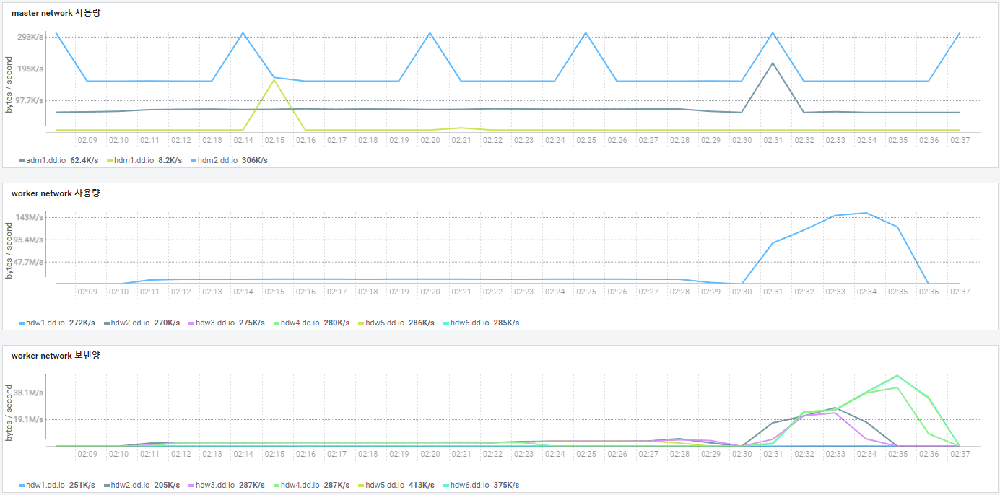

# kudu-jdbc-test

kudu-jdbc-test

```shell
wget http://www.data-dynamics.io/download/ImpalaJDBC42-2.6.26.1031.jar
mkdir -p ~/.m2/repository/Impala/ImpalaJDBC42/2.6.26.1031
cp ImpalaJDBC42-2.6.26.1031.jar ~/.m2/repository/Impala/ImpalaJDBC42/2.6.26.1031/
mvn clean package -DskipTests
```

## log_src

### 원본 데이터 건수

| start_date |  count   |
|:----------:|:--------:|
|  2021-01   | 14569385 |
|  2021-02   | 14473308 |
|  2021-03   | 20719130 |

* w1: yyyy-MM-01 ~ yyyy-MM-15
* w2: yyyy-MM-16 ~ yyyy-MM-말일

| yyyy-mm-ww |  count   |
|:----------:|:--------:|
| ~ 2018-07  | 1012562  |
| 2018-07-w1 |  495926  |
| 2018-07-w2 |  413103  |
| 2018-08-w1 |  596236  |
| 2018-08-w2 |  707552  |
| 2018-09-w1 |  710205  |
| 2018-09-w2 |  783963  |
| 2018-10-w1 |  893992  |
| 2018-10-w2 |  978527  |
| 2018-11-w1 |  976146  |
| 2018-11-w2 | 1017039  |
| 2018-12-w1 | 1002257  |
| 2018-12-w2 | 1241790  |
| 2019-01-w1 |  967693  |
| 2019-01-w2 | 1612397  |
| 2019-02-w1 | 1111238  |
| 2019-02-w2 | 1147663  |
| 2019-03-w1 |  635340  |
| 2019-03-w2 | 1875874  |
| 2019-04-w1 | 1981065  |
| 2019-04-w2 | 2663854  |
| 2019-05-w1 | 2010028  |
| 2019-05-w2 | 3215066  |
| 2019-06-w1 | 6022498  |
| 2019-06-w2 | 1403676  |
| 2019-07-w1 |  655967  |
| 2019-07-w2 | 3370548  |
| 2019-08-w1 | 1424864  |
| 2019-08-w2 | 3972927  |
| 2019-09-w1 | 2541956  |
| 2019-09-w2 | 1966257  |
| 2019-10-w1 |  621196  |
| 2019-10-w2 |  551105  |
| 2019-11-w1 |  897459  |
| 2019-11-w2 | 3653323  |
| 2019-12-w1 | 2967150  |
| 2019-12-w2 | 4638560  |
| 2020-01-w1 | 6858598  |
| 2020-01-w2 | 4756162  |
| 2020-02-w1 | 4979525  |
| 2020-02-w2 | 5927574  |
| 2020-03-w1 | 3556701  |
| 2020-03-w2 | 4703790  |
| 2020-04-w1 | 3318446  |
| 2020-04-w2 | 5548700  |
| 2020-05-w1 | 5110009  |
| 2020-05-w2 | 7655766  |
| 2020-06-w1 | 9314073  |
| 2020-06-w2 | 8912088  |
| 2020-07-w1 | 9785647  |
| 2020-07-w2 | 9938872  |
| 2020-08-w1 | 12819495 |
| 2020-08-w2 | 12057369 |
| 2020-09-w1 | 10404364 |
| 2020-09-w2 | 6980671  |
| 2020-10-w1 | 4588277  |
| 2020-10-w2 | 6250057  |
| 2020-11-w1 | 7943353  |
| 2020-11-w2 | 10693842 |
| 2020-12-w1 | 13473546 |
| 2020-12-w2 | 11018697 |
| 2021-01-w1 | 7639825  |
| 2021-01-w2 | 6929560  |
| 2021-02-w1 | 7123338  |
| 2021-02-w2 | 7349970  |
| 2021-03-w1 | 12052427 |
| 2021-03-w2 | 8666703  |
| 2021-04-w1 | 11232514 |
| 2021-04-w2 | 11585867 |
| 2021-05-w1 | 9274218  |
| 2021-05-w2 | 12019091 |
| 2021-06-w1 | 5114517  |
| 2021-06-w2 | 7349923  |
| 2021-07-w1 | 7549696  |
| 2021-07-w2 | 11251024 |
| 2021-08-w1 | 6545035  |
| 2021-08-w2 | 6313179  |
| 2021-09-w1 | 9437287  |
| 2021-09-w2 | 6160573  |
| 2021-10-w1 | 8776327  |
| 2021-10-w2 | 9376808  |
| 2021-11-w1 | 10495604 |
| 2021-11-w2 | 9045674  |
| 2021-12-w1 | 14030496 |
| 2021-12-w2 | 15739897 |
| 2022-01-w1 | 2685572  |
| 2022-01-w2 | 1462217  |
| 2022-02-w1 | 3043559  |
| 2022-02-w2 | 3180792  |
| 2022-03-w1 | 6050061  |
| 2022-03-w2 | 1418197  |

### DDL

```sql
CREATE TABLE log_src (
start_time TIMESTAMP, b_id STRING, now_time TIMESTAMP, userflag BIGINT, b_name STRING, title STRING,
all_viewer BIGINT, pc_viewer BIGINT, mobile_viewer BIGINT, relay_viewer BIGINT, total_viewer BIGINT,
user_titles STRING, user_id STRING, login_index BIGINT, user_nick STRING, is_mobile BOOLEAN, is_direct_chat_send BOOLEAN,
`from` STRING, `to` STRING, is_admin_direct_chat BOOLEAN, grade STRING, text STRING, version STRING, up_count BIGINT,
p_b_id STRING, p_start_time STRING,
PRIMARY KEY (start_time, b_id, now_time, userflag) )
PARTITION BY HASH (start_time, b_id, now_time, userflag) PARTITIONS 6
comment 'source table only partitions 6'
STORED AS KUDU
TBLPROPERTIES ('kudu.master_addresses'='172.30.1.151:7051,172.30.1.152:7051,172.30.1.153:7051');
```

* start_time 범위: 2021-01-01 00:00:00 ~ 2021-03-31 23:59:59
* data 건수: 49,761,823

## log_p78

```sql
CREATE TABLE log_p78 (
start_time TIMESTAMP, b_id STRING, now_time TIMESTAMP, userflag BIGINT, b_name STRING, title STRING,
all_viewer BIGINT, pc_viewer BIGINT, mobile_viewer BIGINT, relay_viewer BIGINT, total_viewer BIGINT,
user_titles STRING, user_id STRING, login_index BIGINT, user_nick STRING, is_mobile BOOLEAN, is_direct_chat_send BOOLEAN,
`from` STRING, `to` STRING, is_admin_direct_chat BOOLEAN, grade STRING, text STRING, version STRING, up_count BIGINT,
p_b_id STRING, p_start_time STRING,
PRIMARY KEY (start_time, b_id, now_time, userflag) )
PARTITION BY HASH (start_time, b_id, now_time, userflag) PARTITIONS 78
comment 'partitions 78'
STORED AS KUDU
TBLPROPERTIES ('kudu.master_addresses'='172.30.1.151:7051,172.30.1.152:7051,172.30.1.153:7051');
```

## log_range

```sql
CREATE TABLE log_range (
start_time TIMESTAMP, b_id STRING, now_time TIMESTAMP, userflag BIGINT, b_name STRING, title STRING,
all_viewer BIGINT, pc_viewer BIGINT, mobile_viewer BIGINT, relay_viewer BIGINT, total_viewer BIGINT,
user_titles STRING, user_id STRING, login_index BIGINT, user_nick STRING, is_mobile BOOLEAN, is_direct_chat_send BOOLEAN,
`from` STRING, `to` STRING, is_admin_direct_chat BOOLEAN, grade STRING, text STRING, version STRING, up_count BIGINT,
p_b_id STRING, p_start_time STRING,
PRIMARY KEY (start_time, b_id, now_time, userflag) )
PARTITION BY range (start_time)
(
partition values < '2018-07-01 00:00:00',
partition '2022-03-01 00:00:00' <= values < '2022-04-01 00:00:00'
)
comment 'log table daily partition'
STORED AS KUDU
TBLPROPERTIES ('kudu.master_addresses'='172.30.1.151:7051,172.30.1.152:7051,172.30.1.153:7051');

alter table log_range add range partition '2018-07-01 00:00:00' <= values < '2018-07-16 00:00:00';
alter table log_range add range partition '2018-07-16 00:00:00' <= values < '2018-08-01 00:00:00';
alter table log_range add range partition '2018-08-01 00:00:00' <= values < '2018-08-16 00:00:00';
alter table log_range add range partition '2018-08-16 00:00:00' <= values < '2018-09-01 00:00:00';
alter table log_range add range partition '2018-09-01 00:00:00' <= values < '2018-09-16 00:00:00';
alter table log_range add range partition '2018-09-16 00:00:00' <= values < '2018-10-01 00:00:00';
alter table log_range add range partition '2018-10-01 00:00:00' <= values < '2018-10-16 00:00:00';
alter table log_range add range partition '2018-10-16 00:00:00' <= values < '2018-11-01 00:00:00';
alter table log_range add range partition '2018-11-01 00:00:00' <= values < '2018-11-16 00:00:00';
alter table log_range add range partition '2018-11-16 00:00:00' <= values < '2018-12-01 00:00:00';
alter table log_range add range partition '2018-12-01 00:00:00' <= values < '2018-12-16 00:00:00';
alter table log_range add range partition '2018-12-16 00:00:00' <= values < '2019-01-01 00:00:00';
alter table log_range add range partition '2019-01-01 00:00:00' <= values < '2019-01-16 00:00:00';
alter table log_range add range partition '2019-01-16 00:00:00' <= values < '2019-02-01 00:00:00';
alter table log_range add range partition '2019-02-01 00:00:00' <= values < '2019-02-16 00:00:00';
alter table log_range add range partition '2019-02-16 00:00:00' <= values < '2019-03-01 00:00:00';
alter table log_range add range partition '2019-03-01 00:00:00' <= values < '2019-03-16 00:00:00';
alter table log_range add range partition '2019-03-16 00:00:00' <= values < '2019-04-01 00:00:00';
alter table log_range add range partition '2019-04-01 00:00:00' <= values < '2019-04-16 00:00:00';
alter table log_range add range partition '2019-04-16 00:00:00' <= values < '2019-05-01 00:00:00';
alter table log_range add range partition '2019-05-01 00:00:00' <= values < '2019-05-16 00:00:00';
alter table log_range add range partition '2019-05-16 00:00:00' <= values < '2019-06-01 00:00:00';
alter table log_range add range partition '2019-06-01 00:00:00' <= values < '2019-06-16 00:00:00';
alter table log_range add range partition '2019-06-16 00:00:00' <= values < '2019-07-01 00:00:00';
alter table log_range add range partition '2019-07-01 00:00:00' <= values < '2019-07-16 00:00:00';
alter table log_range add range partition '2019-07-16 00:00:00' <= values < '2019-08-01 00:00:00';
alter table log_range add range partition '2019-08-01 00:00:00' <= values < '2019-08-16 00:00:00';
alter table log_range add range partition '2019-08-16 00:00:00' <= values < '2019-09-01 00:00:00';
alter table log_range add range partition '2019-09-01 00:00:00' <= values < '2019-09-16 00:00:00';
alter table log_range add range partition '2019-09-16 00:00:00' <= values < '2019-10-01 00:00:00';
alter table log_range add range partition '2019-10-01 00:00:00' <= values < '2019-10-16 00:00:00';
alter table log_range add range partition '2019-10-16 00:00:00' <= values < '2019-11-01 00:00:00';
alter table log_range add range partition '2019-11-01 00:00:00' <= values < '2019-11-16 00:00:00';
alter table log_range add range partition '2019-11-16 00:00:00' <= values < '2019-12-01 00:00:00';
alter table log_range add range partition '2019-12-01 00:00:00' <= values < '2019-12-16 00:00:00';
alter table log_range add range partition '2019-12-16 00:00:00' <= values < '2020-01-01 00:00:00';
alter table log_range add range partition '2020-01-01 00:00:00' <= values < '2020-01-16 00:00:00';
alter table log_range add range partition '2020-01-16 00:00:00' <= values < '2020-02-01 00:00:00';
alter table log_range add range partition '2020-02-01 00:00:00' <= values < '2020-02-16 00:00:00';
alter table log_range add range partition '2020-02-16 00:00:00' <= values < '2020-03-01 00:00:00';
alter table log_range add range partition '2020-03-01 00:00:00' <= values < '2020-03-16 00:00:00';
alter table log_range add range partition '2020-03-16 00:00:00' <= values < '2020-04-01 00:00:00';
alter table log_range add range partition '2020-04-01 00:00:00' <= values < '2020-04-16 00:00:00';
alter table log_range add range partition '2020-04-16 00:00:00' <= values < '2020-05-01 00:00:00';
alter table log_range add range partition '2020-05-01 00:00:00' <= values < '2020-05-16 00:00:00';
alter table log_range add range partition '2020-05-16 00:00:00' <= values < '2020-06-01 00:00:00';
alter table log_range add range partition '2020-06-01 00:00:00' <= values < '2020-06-16 00:00:00';
alter table log_range add range partition '2020-06-16 00:00:00' <= values < '2020-07-01 00:00:00';
alter table log_range add range partition '2020-07-01 00:00:00' <= values < '2020-07-16 00:00:00';
alter table log_range add range partition '2020-07-16 00:00:00' <= values < '2020-08-01 00:00:00';
alter table log_range add range partition '2020-08-01 00:00:00' <= values < '2020-08-16 00:00:00';
alter table log_range add range partition '2020-08-16 00:00:00' <= values < '2020-09-01 00:00:00';
alter table log_range add range partition '2020-09-01 00:00:00' <= values < '2020-09-16 00:00:00';
alter table log_range add range partition '2020-09-16 00:00:00' <= values < '2020-10-01 00:00:00';
alter table log_range add range partition '2020-10-01 00:00:00' <= values < '2020-10-16 00:00:00';
alter table log_range add range partition '2020-10-16 00:00:00' <= values < '2020-11-01 00:00:00';
alter table log_range add range partition '2020-11-01 00:00:00' <= values < '2020-11-16 00:00:00';
alter table log_range add range partition '2020-11-16 00:00:00' <= values < '2020-12-01 00:00:00';
alter table log_range add range partition '2020-12-01 00:00:00' <= values < '2020-12-16 00:00:00';
alter table log_range add range partition '2020-12-16 00:00:00' <= values < '2021-01-01 00:00:00';
alter table log_range add range partition '2021-01-01 00:00:00' <= values < '2021-01-16 00:00:00';
alter table log_range add range partition '2021-01-16 00:00:00' <= values < '2021-02-01 00:00:00';
alter table log_range add range partition '2021-02-01 00:00:00' <= values < '2021-02-16 00:00:00';
alter table log_range add range partition '2021-02-16 00:00:00' <= values < '2021-03-01 00:00:00';
alter table log_range add range partition '2021-03-01 00:00:00' <= values < '2021-03-16 00:00:00';
alter table log_range add range partition '2021-03-16 00:00:00' <= values < '2021-04-01 00:00:00';
alter table log_range add range partition '2021-04-01 00:00:00' <= values < '2021-04-16 00:00:00';
alter table log_range add range partition '2021-04-16 00:00:00' <= values < '2021-05-01 00:00:00';
alter table log_range add range partition '2021-05-01 00:00:00' <= values < '2021-05-16 00:00:00';
alter table log_range add range partition '2021-05-16 00:00:00' <= values < '2021-06-01 00:00:00';
alter table log_range add range partition '2021-06-01 00:00:00' <= values < '2021-06-16 00:00:00';
alter table log_range add range partition '2021-06-16 00:00:00' <= values < '2021-07-01 00:00:00';
alter table log_range add range partition '2021-07-01 00:00:00' <= values < '2021-07-16 00:00:00';
alter table log_range add range partition '2021-07-16 00:00:00' <= values < '2021-08-01 00:00:00';
alter table log_range add range partition '2021-08-01 00:00:00' <= values < '2021-08-16 00:00:00';
alter table log_range add range partition '2021-08-16 00:00:00' <= values < '2021-09-01 00:00:00';
alter table log_range add range partition '2021-09-01 00:00:00' <= values < '2021-09-16 00:00:00';
alter table log_range add range partition '2021-09-16 00:00:00' <= values < '2021-10-01 00:00:00';
alter table log_range add range partition '2021-10-01 00:00:00' <= values < '2021-10-16 00:00:00';
alter table log_range add range partition '2021-10-16 00:00:00' <= values < '2021-11-01 00:00:00';
alter table log_range add range partition '2021-11-01 00:00:00' <= values < '2021-11-16 00:00:00';
alter table log_range add range partition '2021-11-16 00:00:00' <= values < '2021-12-01 00:00:00';
alter table log_range add range partition '2021-12-01 00:00:00' <= values < '2021-12-16 00:00:00';
alter table log_range add range partition '2021-12-16 00:00:00' <= values < '2022-01-01 00:00:00';
alter table log_range add range partition '2022-01-01 00:00:00' <= values < '2022-01-16 00:00:00';
alter table log_range add range partition '2022-01-16 00:00:00' <= values < '2022-02-01 00:00:00';
alter table log_range add range partition '2022-02-01 00:00:00' <= values < '2022-02-16 00:00:00';
alter table log_range add range partition '2022-02-16 00:00:00' <= values < '2022-03-01 00:00:00';
```

## log_hash_range

```sql
CREATE TABLE log_hash_range (
start_time TIMESTAMP, b_id STRING, now_time TIMESTAMP, userflag BIGINT, b_name STRING, title STRING,
all_viewer BIGINT, pc_viewer BIGINT, mobile_viewer BIGINT, relay_viewer BIGINT, total_viewer BIGINT,
user_titles STRING, user_id STRING, login_index BIGINT, user_nick STRING, is_mobile BOOLEAN, is_direct_chat_send BOOLEAN,
`from` STRING, `to` STRING, is_admin_direct_chat BOOLEAN, grade STRING, text STRING, version STRING, up_count BIGINT,
p_b_id STRING, p_start_time STRING,
PRIMARY KEY (start_time, b_id, now_time, userflag) )
PARTITION BY HASH (start_time, b_id, now_time, userflag) PARTITIONS 6,
range (start_time)
(
partition values < '2018-07-01 00:00:00',
partition '2022-03-01 00:00:00' <= values < '2022-04-01 00:00:00'
)
comment 'log table hash 6 daily partition'
STORED AS KUDU
TBLPROPERTIES ('kudu.master_addresses'='172.30.1.151:7051,172.30.1.152:7051,172.30.1.153:7051');

alter table log_hash_range add range partition '2018-07-01 00:00:00' <= values < '2018-07-16 00:00:00';
alter table log_hash_range add range partition '2018-07-16 00:00:00' <= values < '2018-08-01 00:00:00';
alter table log_hash_range add range partition '2018-08-01 00:00:00' <= values < '2018-08-16 00:00:00';
alter table log_hash_range add range partition '2018-08-16 00:00:00' <= values < '2018-09-01 00:00:00';
alter table log_hash_range add range partition '2018-09-01 00:00:00' <= values < '2018-09-16 00:00:00';
alter table log_hash_range add range partition '2018-09-16 00:00:00' <= values < '2018-10-01 00:00:00';
alter table log_hash_range add range partition '2018-10-01 00:00:00' <= values < '2018-10-16 00:00:00';
alter table log_hash_range add range partition '2018-10-16 00:00:00' <= values < '2018-11-01 00:00:00';
alter table log_hash_range add range partition '2018-11-01 00:00:00' <= values < '2018-11-16 00:00:00';
alter table log_hash_range add range partition '2018-11-16 00:00:00' <= values < '2018-12-01 00:00:00';
alter table log_hash_range add range partition '2018-12-01 00:00:00' <= values < '2018-12-16 00:00:00';
alter table log_hash_range add range partition '2018-12-16 00:00:00' <= values < '2019-01-01 00:00:00';
alter table log_hash_range add range partition '2019-01-01 00:00:00' <= values < '2019-01-16 00:00:00';
alter table log_hash_range add range partition '2019-01-16 00:00:00' <= values < '2019-02-01 00:00:00';
alter table log_hash_range add range partition '2019-02-01 00:00:00' <= values < '2019-02-16 00:00:00';
alter table log_hash_range add range partition '2019-02-16 00:00:00' <= values < '2019-03-01 00:00:00';
alter table log_hash_range add range partition '2019-03-01 00:00:00' <= values < '2019-03-16 00:00:00';
alter table log_hash_range add range partition '2019-03-16 00:00:00' <= values < '2019-04-01 00:00:00';
alter table log_hash_range add range partition '2019-04-01 00:00:00' <= values < '2019-04-16 00:00:00';
alter table log_hash_range add range partition '2019-04-16 00:00:00' <= values < '2019-05-01 00:00:00';
alter table log_hash_range add range partition '2019-05-01 00:00:00' <= values < '2019-05-16 00:00:00';
alter table log_hash_range add range partition '2019-05-16 00:00:00' <= values < '2019-06-01 00:00:00';
alter table log_hash_range add range partition '2019-06-01 00:00:00' <= values < '2019-06-16 00:00:00';
alter table log_hash_range add range partition '2019-06-16 00:00:00' <= values < '2019-07-01 00:00:00';
alter table log_hash_range add range partition '2019-07-01 00:00:00' <= values < '2019-07-16 00:00:00';
alter table log_hash_range add range partition '2019-07-16 00:00:00' <= values < '2019-08-01 00:00:00';
alter table log_hash_range add range partition '2019-08-01 00:00:00' <= values < '2019-08-16 00:00:00';
alter table log_hash_range add range partition '2019-08-16 00:00:00' <= values < '2019-09-01 00:00:00';
alter table log_hash_range add range partition '2019-09-01 00:00:00' <= values < '2019-09-16 00:00:00';
alter table log_hash_range add range partition '2019-09-16 00:00:00' <= values < '2019-10-01 00:00:00';
alter table log_hash_range add range partition '2019-10-01 00:00:00' <= values < '2019-10-16 00:00:00';
alter table log_hash_range add range partition '2019-10-16 00:00:00' <= values < '2019-11-01 00:00:00';
alter table log_hash_range add range partition '2019-11-01 00:00:00' <= values < '2019-11-16 00:00:00';
alter table log_hash_range add range partition '2019-11-16 00:00:00' <= values < '2019-12-01 00:00:00';
alter table log_hash_range add range partition '2019-12-01 00:00:00' <= values < '2019-12-16 00:00:00';
alter table log_hash_range add range partition '2019-12-16 00:00:00' <= values < '2020-01-01 00:00:00';
alter table log_hash_range add range partition '2020-01-01 00:00:00' <= values < '2020-01-16 00:00:00';
alter table log_hash_range add range partition '2020-01-16 00:00:00' <= values < '2020-02-01 00:00:00';
alter table log_hash_range add range partition '2020-02-01 00:00:00' <= values < '2020-02-16 00:00:00';
alter table log_hash_range add range partition '2020-02-16 00:00:00' <= values < '2020-03-01 00:00:00';
alter table log_hash_range add range partition '2020-03-01 00:00:00' <= values < '2020-03-16 00:00:00';
alter table log_hash_range add range partition '2020-03-16 00:00:00' <= values < '2020-04-01 00:00:00';
alter table log_hash_range add range partition '2020-04-01 00:00:00' <= values < '2020-04-16 00:00:00';
alter table log_hash_range add range partition '2020-04-16 00:00:00' <= values < '2020-05-01 00:00:00';
alter table log_hash_range add range partition '2020-05-01 00:00:00' <= values < '2020-05-16 00:00:00';
alter table log_hash_range add range partition '2020-05-16 00:00:00' <= values < '2020-06-01 00:00:00';
alter table log_hash_range add range partition '2020-06-01 00:00:00' <= values < '2020-06-16 00:00:00';
alter table log_hash_range add range partition '2020-06-16 00:00:00' <= values < '2020-07-01 00:00:00';
alter table log_hash_range add range partition '2020-07-01 00:00:00' <= values < '2020-07-16 00:00:00';
alter table log_hash_range add range partition '2020-07-16 00:00:00' <= values < '2020-08-01 00:00:00';
alter table log_hash_range add range partition '2020-08-01 00:00:00' <= values < '2020-08-16 00:00:00';
alter table log_hash_range add range partition '2020-08-16 00:00:00' <= values < '2020-09-01 00:00:00';
alter table log_hash_range add range partition '2020-09-01 00:00:00' <= values < '2020-09-16 00:00:00';
alter table log_hash_range add range partition '2020-09-16 00:00:00' <= values < '2020-10-01 00:00:00';
alter table log_hash_range add range partition '2020-10-01 00:00:00' <= values < '2020-10-16 00:00:00';
alter table log_hash_range add range partition '2020-10-16 00:00:00' <= values < '2020-11-01 00:00:00';
alter table log_hash_range add range partition '2020-11-01 00:00:00' <= values < '2020-11-16 00:00:00';
alter table log_hash_range add range partition '2020-11-16 00:00:00' <= values < '2020-12-01 00:00:00';
alter table log_hash_range add range partition '2020-12-01 00:00:00' <= values < '2020-12-16 00:00:00';
alter table log_hash_range add range partition '2020-12-16 00:00:00' <= values < '2021-01-01 00:00:00';
alter table log_hash_range add range partition '2021-01-01 00:00:00' <= values < '2021-01-16 00:00:00';
alter table log_hash_range add range partition '2021-01-16 00:00:00' <= values < '2021-02-01 00:00:00';
alter table log_hash_range add range partition '2021-02-01 00:00:00' <= values < '2021-02-16 00:00:00';
alter table log_hash_range add range partition '2021-02-16 00:00:00' <= values < '2021-03-01 00:00:00';
alter table log_hash_range add range partition '2021-03-01 00:00:00' <= values < '2021-03-16 00:00:00';
alter table log_hash_range add range partition '2021-03-16 00:00:00' <= values < '2021-04-01 00:00:00';
alter table log_hash_range add range partition '2021-04-01 00:00:00' <= values < '2021-04-16 00:00:00';
alter table log_hash_range add range partition '2021-04-16 00:00:00' <= values < '2021-05-01 00:00:00';
alter table log_hash_range add range partition '2021-05-01 00:00:00' <= values < '2021-05-16 00:00:00';
alter table log_hash_range add range partition '2021-05-16 00:00:00' <= values < '2021-06-01 00:00:00';
alter table log_hash_range add range partition '2021-06-01 00:00:00' <= values < '2021-06-16 00:00:00';
alter table log_hash_range add range partition '2021-06-16 00:00:00' <= values < '2021-07-01 00:00:00';
alter table log_hash_range add range partition '2021-07-01 00:00:00' <= values < '2021-07-16 00:00:00';
alter table log_hash_range add range partition '2021-07-16 00:00:00' <= values < '2021-08-01 00:00:00';
alter table log_hash_range add range partition '2021-08-01 00:00:00' <= values < '2021-08-16 00:00:00';
alter table log_hash_range add range partition '2021-08-16 00:00:00' <= values < '2021-09-01 00:00:00';
alter table log_hash_range add range partition '2021-09-01 00:00:00' <= values < '2021-09-16 00:00:00';
alter table log_hash_range add range partition '2021-09-16 00:00:00' <= values < '2021-10-01 00:00:00';
alter table log_hash_range add range partition '2021-10-01 00:00:00' <= values < '2021-10-16 00:00:00';
alter table log_hash_range add range partition '2021-10-16 00:00:00' <= values < '2021-11-01 00:00:00';
alter table log_hash_range add range partition '2021-11-01 00:00:00' <= values < '2021-11-16 00:00:00';
alter table log_hash_range add range partition '2021-11-16 00:00:00' <= values < '2021-12-01 00:00:00';
alter table log_hash_range add range partition '2021-12-01 00:00:00' <= values < '2021-12-16 00:00:00';
alter table log_hash_range add range partition '2021-12-16 00:00:00' <= values < '2022-01-01 00:00:00';
alter table log_hash_range add range partition '2022-01-01 00:00:00' <= values < '2022-01-16 00:00:00';
alter table log_hash_range add range partition '2022-01-16 00:00:00' <= values < '2022-02-01 00:00:00';
alter table log_hash_range add range partition '2022-02-01 00:00:00' <= values < '2022-02-16 00:00:00';
alter table log_hash_range add range partition '2022-02-16 00:00:00' <= values < '2022-03-01 00:00:00';
```

## data 적재

```sql
upsert into log_hash_range
/*+ NOCLUSTERED */
select
start_time, bj_id, now_time, userflag, bj_name, title,
all_viewer, pc_viewer, mobile_viewer, relay_viewer, total_viewer,
user_titles, user_id, login_index, user_nick, is_mobile, is_direct_chat_send,
`from`, `to`, is_admin_direct_chat, grade, text, version, up_count,
p_bj_id, p_start_time
from chatlog;
```

## 압축 테스트

### ENCODING Attribute

| Column Type              | Encoding                      | Default    |
|:-------------------------|:------------------------------|:-----------|
| int, int16, int32, int64 | plain, bitshuffle, run length | bitshuffle |
| date, unixtime_micros    | plain, bitshuffle, run length | bitshuffle |
| float, double, decimal   | plain, bitshuffle             | bitshuffle |
| bool                     | plain, run length             | run length |
| string, varchar, binary  | plain, prefix, dictionary     | dictionary |

* AUTO_ENCODING: 숫자 - BIT_SHUFFLE, 문자열 - DICT_ENCODING
* PLAIN_ENCODING: 원본 binary format 으로 둠
* RLE: Run Length Encoding. 개수를 포함해서(primary key 순서로 정렬된 경우) 반복되는 값을 압축
  * ```text
    20220401_144459.231
    20220401_144459.231 => 20220401_144459.231 | 4
    20220401_144459.231
    20220401_144459.231
    ```
* DICT_ENCODING: 다른 문자열 값 수가 작은 경우, 원본 문자열을 numeric ID 로 대체함. cardinality 가 낮은 column 에 좋음
* BIT_SHUFFLE: primary key 순서 기반으로 같거나 약간만 다른 순서를 효율적으로 압축하기 위해 비트값을 재배열 함. 인코딩 결과는 LZ4 로 압축됨. 반복되는 값이 많거나 primary key 로 정렬될 때 값이 조금씩 바뀌는 경우에 좋음.
  * ```text
    11010010    1111 1111
    11010011 => 0000 1111
    11010100    0000 0011
    11010101    1100 0101
    ```
* PREFIX_ENCODING: 문자열 값에서 공통 접두사를 압축함. 주로 Kudu 내부에서 사용함

### COMPRESSION Attribute

* ENCODING attribute 보다 CPU overhead 가 있음
* ENCODING attribute 이점이 없는 긴 문자열 column 에 주로 사용
* LZ4, SNAPPY, ZLIB 선택 가능
* BITSHUFFLE encoding 은 이미 LZ4 를 사용하여 압축하므로 추가로 COMPRESSION attribute 가 필요하지 않음

### BLOCK_SIZE Attribute

* Kudu 는 HDFS 를 사용하지 않지만, block size 라는 기본 I/O 단위가 있음
* BLOCK_SIZE 속성을 사용해서 모든 column 의 block size 를 설정할 수 있음

### DDL/DML

```sql
CREATE TABLE log_src_auto (
start_time TIMESTAMP,
b_id STRING,
now_time TIMESTAMP,
userflag BIGINT,
b_name STRING,
title STRING,
all_viewer BIGINT,
pc_viewer BIGINT,
mobile_viewer BIGINT,
relay_viewer BIGINT,
total_viewer BIGINT,
user_titles STRING,
user_id STRING,
login_index BIGINT,
user_nick STRING,
is_mobile BOOLEAN,
is_direct_chat_send BOOLEAN,
`from` STRING,
`to` STRING,
is_admin_direct_chat BOOLEAN,
grade STRING,
text STRING,
version STRING,
up_count BIGINT,
p_b_id STRING,
p_start_time STRING,
PRIMARY KEY (start_time, b_id, now_time, userflag) )
PARTITION BY HASH (start_time, b_id, now_time, userflag) PARTITIONS 6
comment 'source table only partitions 6'
STORED AS KUDU
TBLPROPERTIES ('kudu.master_addresses'='172.30.1.151:7051,172.30.1.152:7051,172.30.1.153:7051');
-- On-Disk Size (leaders only): 544.29M
-- elapsed: 12914.342151 ms

upsert into log_src_auto
/*+ NOCLUSTERED */
select
start_time, bj_id, now_time, userflag, bj_name, title,
all_viewer, pc_viewer, mobile_viewer, relay_viewer, total_viewer,
user_titles, user_id, login_index, user_nick, is_mobile, is_direct_chat_send,
`from`, `to`, is_admin_direct_chat, grade, text, version, up_count,
p_bj_id, p_start_time
from chatlog
where p_start_time < '20180701_000000';

CREATE TABLE log_src_snappy (
start_time TIMESTAMP ENCODING AUTO_ENCODING COMPRESSION DEFAULT_COMPRESSION,
b_id STRING ENCODING AUTO_ENCODING COMPRESSION DEFAULT_COMPRESSION,
now_time TIMESTAMP ENCODING AUTO_ENCODING COMPRESSION DEFAULT_COMPRESSION,
userflag BIGINT ENCODING AUTO_ENCODING COMPRESSION DEFAULT_COMPRESSION,
b_name STRING ENCODING AUTO_ENCODING COMPRESSION DEFAULT_COMPRESSION,
title STRING ENCODING AUTO_ENCODING COMPRESSION DEFAULT_COMPRESSION,
all_viewer BIGINT ENCODING AUTO_ENCODING COMPRESSION DEFAULT_COMPRESSION,
pc_viewer BIGINT ENCODING AUTO_ENCODING COMPRESSION DEFAULT_COMPRESSION,
mobile_viewer BIGINT ENCODING AUTO_ENCODING COMPRESSION DEFAULT_COMPRESSION,
relay_viewer BIGINT ENCODING AUTO_ENCODING COMPRESSION DEFAULT_COMPRESSION,
total_viewer BIGINT ENCODING AUTO_ENCODING COMPRESSION DEFAULT_COMPRESSION,
user_titles STRING ENCODING AUTO_ENCODING COMPRESSION DEFAULT_COMPRESSION,
user_id STRING ENCODING AUTO_ENCODING COMPRESSION DEFAULT_COMPRESSION,
login_index BIGINT ENCODING AUTO_ENCODING COMPRESSION DEFAULT_COMPRESSION,
user_nick STRING ENCODING AUTO_ENCODING COMPRESSION DEFAULT_COMPRESSION,
is_mobile BOOLEAN ENCODING AUTO_ENCODING COMPRESSION DEFAULT_COMPRESSION,
is_direct_chat_send BOOLEAN ENCODING AUTO_ENCODING COMPRESSION DEFAULT_COMPRESSION,
`from` STRING ENCODING AUTO_ENCODING COMPRESSION DEFAULT_COMPRESSION,
`to` STRING ENCODING AUTO_ENCODING COMPRESSION DEFAULT_COMPRESSION,
is_admin_direct_chat BOOLEAN ENCODING AUTO_ENCODING COMPRESSION DEFAULT_COMPRESSION,
grade STRING ENCODING AUTO_ENCODING COMPRESSION DEFAULT_COMPRESSION,
text STRING ENCODING AUTO_ENCODING COMPRESSION SNAPPY,
version STRING ENCODING AUTO_ENCODING COMPRESSION DEFAULT_COMPRESSION,
up_count BIGINT ENCODING AUTO_ENCODING COMPRESSION DEFAULT_COMPRESSION,
p_b_id STRING ENCODING AUTO_ENCODING COMPRESSION DEFAULT_COMPRESSION,
p_start_time STRING ENCODING AUTO_ENCODING COMPRESSION DEFAULT_COMPRESSION,
PRIMARY KEY (start_time, b_id, now_time, userflag) )
PARTITION BY HASH (start_time, b_id, now_time, userflag) PARTITIONS 6
comment 'source table only partitions 6'
STORED AS KUDU
TBLPROPERTIES ('kudu.master_addresses'='172.30.1.151:7051,172.30.1.152:7051,172.30.1.153:7051');
-- On-Disk Size (leaders only): 536.09M
-- elapsed: 12965.708414 ms

upsert into log_src_snappy
/*+ NOCLUSTERED */
select
start_time, bj_id, now_time, userflag, bj_name, title,
all_viewer, pc_viewer, mobile_viewer, relay_viewer, total_viewer,
user_titles, user_id, login_index, user_nick, is_mobile, is_direct_chat_send,
`from`, `to`, is_admin_direct_chat, grade, text, version, up_count,
p_bj_id, p_start_time
from chatlog
where p_start_time < '20180701_000000';

CREATE TABLE log_src_snappy2 (
start_time TIMESTAMP ENCODING AUTO_ENCODING COMPRESSION DEFAULT_COMPRESSION,
b_id STRING ENCODING AUTO_ENCODING COMPRESSION SNAPPY,
now_time TIMESTAMP ENCODING AUTO_ENCODING COMPRESSION DEFAULT_COMPRESSION,
userflag BIGINT ENCODING AUTO_ENCODING COMPRESSION DEFAULT_COMPRESSION,
b_name STRING ENCODING AUTO_ENCODING COMPRESSION SNAPPY,
title STRING ENCODING AUTO_ENCODING COMPRESSION SNAPPY,
all_viewer BIGINT ENCODING AUTO_ENCODING COMPRESSION DEFAULT_COMPRESSION,
pc_viewer BIGINT ENCODING AUTO_ENCODING COMPRESSION DEFAULT_COMPRESSION,
mobile_viewer BIGINT ENCODING AUTO_ENCODING COMPRESSION DEFAULT_COMPRESSION,
relay_viewer BIGINT ENCODING AUTO_ENCODING COMPRESSION DEFAULT_COMPRESSION,
total_viewer BIGINT ENCODING AUTO_ENCODING COMPRESSION DEFAULT_COMPRESSION,
user_titles STRING ENCODING AUTO_ENCODING COMPRESSION SNAPPY,
user_id STRING ENCODING AUTO_ENCODING COMPRESSION SNAPPY,
login_index BIGINT ENCODING AUTO_ENCODING COMPRESSION DEFAULT_COMPRESSION,
user_nick STRING ENCODING AUTO_ENCODING COMPRESSION SNAPPY,
is_mobile BOOLEAN ENCODING AUTO_ENCODING COMPRESSION SNAPPY,
is_direct_chat_send BOOLEAN ENCODING AUTO_ENCODING COMPRESSION SNAPPY,
`from` STRING ENCODING AUTO_ENCODING COMPRESSION SNAPPY,
`to` STRING ENCODING AUTO_ENCODING COMPRESSION SNAPPY,
is_admin_direct_chat BOOLEAN ENCODING AUTO_ENCODING COMPRESSION SNAPPY,
grade STRING ENCODING AUTO_ENCODING COMPRESSION SNAPPY,
text STRING ENCODING AUTO_ENCODING COMPRESSION SNAPPY,
version STRING ENCODING AUTO_ENCODING COMPRESSION SNAPPY,
up_count BIGINT ENCODING AUTO_ENCODING COMPRESSION DEFAULT_COMPRESSION,
p_b_id STRING ENCODING AUTO_ENCODING COMPRESSION SNAPPY,
p_start_time STRING ENCODING AUTO_ENCODING COMPRESSION SNAPPY,
PRIMARY KEY (start_time, b_id, now_time, userflag) )
PARTITION BY HASH (start_time, b_id, now_time, userflag) PARTITIONS 6
comment 'source table only partitions 6'
STORED AS KUDU
TBLPROPERTIES ('kudu.master_addresses'='172.30.1.151:7051,172.30.1.152:7051,172.30.1.153:7051');
-- On-Disk Size (leaders only): 529.50M
-- elapsed: 13385.156732 ms

upsert into log_src_snappy2
/*+ NOCLUSTERED */
select
start_time, bj_id, now_time, userflag, bj_name, title,
all_viewer, pc_viewer, mobile_viewer, relay_viewer, total_viewer,
user_titles, user_id, login_index, user_nick, is_mobile, is_direct_chat_send,
`from`, `to`, is_admin_direct_chat, grade, text, version, up_count,
p_bj_id, p_start_time
from chatlog
where p_start_time < '20180701_000000';
```

| Table Name      | Size (MB)  | Select Speed (ms)  |
|:----------------|:----------:|:------------------:|
| log_src_auto    |   544.29   |    12914.342151    |
| log_src_snappy  |   536.09   |    12965.708414    |
| log_src_snappy2 |   529.50   |    13385.156732    |

## Performance 측정

모든 테이블의 start_time: '2021-02-01 00:00:00' ~ '2021-02-28 23:59:59' data 가져오는 시간 측정

### 측정

* log_src: hash 6
* log_p78: hash 78
* log_range: range daily
* log_hash_range: hash 6 range daily

|      Table      | Speed (s)     |
|:---------------:|:--------------|
|    log_hash6    | 189.129470227 |
|   log_hash78    | 190.034775058 |
| log_hash6_range | 192.066693054 |
|    log_range    | 191.579579117 |

## hms 활성

### Cloudera Manager

cm > kudu > hms_service > restart

### CLI 작업

**테이블 별로 실행 필요**

```shell
sudo -u kudu kudu hms check adm1,hdm1,hdm2
sudo -u kudu kudu table rename_table --modify_external_catalogs=false adm1.dd.io:7051,hdm1.dd.io:7051,hdm2.dd.io:7051 impala::default.log_p78 default.log_p78_hms
sudo -u kudu kudu hms fix adm1.dd.io:7051,hdm1.dd.io:7051,hdm2.dd.io:7051
```

```text
[root@hdw1:~]# sudo -u kudu kudu hms check adm1,hdm1,hdm2
I0329 15:56:02.752041 37973 tool_action_hms.cc:423] Skipping HMS table default.timetest with different masters specified: 172.30.1.151:7051,172.30.1.152:7051,172.30.1.153:7051
I0329 15:56:02.752133 37973 tool_action_hms.cc:423] Skipping HMS table default.chat_kudu with different masters specified: 172.30.1.151:7051,172.30.1.152:7051,172.30.1.153:7051
I0329 15:56:02.752142 37973 tool_action_hms.cc:423] Skipping HMS table default.log_src with different masters specified: 172.30.1.151:7051,172.30.1.152:7051,172.30.1.153:7051
I0329 15:56:02.752151 37973 tool_action_hms.cc:423] Skipping HMS table default.log_p78 with different masters specified: 172.30.1.151:7051,172.30.1.152:7051,172.30.1.153:7051
I0329 15:56:02.752158 37973 tool_action_hms.cc:423] Skipping HMS table default.log_range with different masters specified: 172.30.1.151:7051,172.30.1.152:7051,172.30.1.153:7051
I0329 15:56:02.752166 37973 tool_action_hms.cc:423] Skipping HMS table default.log_hash_range with different masters specified: 172.30.1.151:7051,172.30.1.152:7051,172.30.1.153:7051
Found Kudu table(s) with Hive-incompatible names:
           Kudu table           |          Kudu table ID           |              Kudu master addresses
--------------------------------+----------------------------------+-------------------------------------------------
 impala::default.log_src        | f442d77542964d3fafe7e6e36102ad5a | adm1.dd.io:7051,hdm1.dd.io:7051,hdm2.dd.io:7051
 impala::default.log_p78        | 378720c4e9a441a88eb9878438330011 | adm1.dd.io:7051,hdm1.dd.io:7051,hdm2.dd.io:7051
 impala::default.timetest       | 1ea576d35b714106891daee3a2162557 | adm1.dd.io:7051,hdm1.dd.io:7051,hdm2.dd.io:7051
 impala::default.log_hash_range | ec6847f3bbfe4b18881a86a81f38e6a2 | adm1.dd.io:7051,hdm1.dd.io:7051,hdm2.dd.io:7051
 impala::default.log_range      | ec1c22927e5341809936fa1ff6f5d874 | adm1.dd.io:7051,hdm1.dd.io:7051,hdm2.dd.io:7051
 impala::default.chat_kudu      | 156e81e3ca714b8b8e7ae32effdbf94e | adm1.dd.io:7051,hdm1.dd.io:7051,hdm2.dd.io:7051

Suggestion: rename the Kudu table(s) to be Hive-compatible, then run the fix tool:
	$ kudu table rename_table --modify_external_catalogs=false adm1.dd.io:7051,hdm1.dd.io:7051,hdm2.dd.io:7051 impala::default.log_src <database-name>.<table-name>
	$ kudu table rename_table --modify_external_catalogs=false adm1.dd.io:7051,hdm1.dd.io:7051,hdm2.dd.io:7051 impala::default.log_p78 <database-name>.<table-name>
	$ kudu table rename_table --modify_external_catalogs=false adm1.dd.io:7051,hdm1.dd.io:7051,hdm2.dd.io:7051 impala::default.timetest <database-name>.<table-name>
	$ kudu table rename_table --modify_external_catalogs=false adm1.dd.io:7051,hdm1.dd.io:7051,hdm2.dd.io:7051 impala::default.log_hash_range <database-name>.<table-name>
	$ kudu table rename_table --modify_external_catalogs=false adm1.dd.io:7051,hdm1.dd.io:7051,hdm2.dd.io:7051 impala::default.log_range <database-name>.<table-name>
	$ kudu table rename_table --modify_external_catalogs=false adm1.dd.io:7051,hdm1.dd.io:7051,hdm2.dd.io:7051 impala::default.chat_kudu <database-name>.<table-name>

Illegal state: found inconsistencies in the Kudu and HMS catalogs
[root@hdw1:~]# sudo -u kudu kudu table rename_table --modify_external_catalogs=false adm1.dd.io:7051,hdm1.dd.io:7051,hdm2.dd.io:7051 impala::default.log_p78 default.log_p78_hms
[root@hdw1:~]# sudo -u kudu kudu hms fix adm1.dd.io:7051,hdm1.dd.io:7051,hdm2.dd.io:7051
I0329 16:24:56.052031 41621 tool_action_hms.cc:423] Skipping HMS table default.timetest with different masters specified: 172.30.1.151:7051,172.30.1.152:7051,172.30.1.153:7051
I0329 16:24:56.052222 41621 tool_action_hms.cc:423] Skipping HMS table default.chat_kudu with different masters specified: 172.30.1.151:7051,172.30.1.152:7051,172.30.1.153:7051
I0329 16:24:56.052230 41621 tool_action_hms.cc:423] Skipping HMS table default.log_src with different masters specified: 172.30.1.151:7051,172.30.1.152:7051,172.30.1.153:7051
I0329 16:24:56.052238 41621 tool_action_hms.cc:423] Skipping HMS table default.log_p78 with different masters specified: 172.30.1.151:7051,172.30.1.152:7051,172.30.1.153:7051
I0329 16:24:56.052245 41621 tool_action_hms.cc:423] Skipping HMS table default.log_range with different masters specified: 172.30.1.151:7051,172.30.1.152:7051,172.30.1.153:7051
I0329 16:24:56.052253 41621 tool_action_hms.cc:423] Skipping HMS table default.log_hash_range with different masters specified: 172.30.1.151:7051,172.30.1.152:7051,172.30.1.153:7051
I0329 16:24:56.052273 41621 tool_action_hms.cc:423] Skipping HMS table default.test_hash_range with different masters specified: 172.30.1.151:7051,172.30.1.152:7051,172.30.1.153:7051
[root@hdw1:~]# 
```

### 재측정

|     Table      | Speed (s)     |
|:--------------:|:--------------|
|    log_src     | 178.830688307 |
|    log_p78     | 181.1108892   |
|   log_range    | 191.579579117 |
| log_hash_range | 192.066693054 |

* 전체적으로 10초정도 줄어들긴 했지만 hms 활성화 위해 재시작한 것의 영향으로 보임
* hms 적용 전 table 조회하면 동일하게 10초정도 줄어들었음

### 실행 query

```sql
select *
from log_src
where start_time between '2021-02-01 00:00:00' and '2021-02-28 23:59:59';
```

```sql
select *
from log_p78
where start_time between '2021-02-01 00:00:00' and '2021-02-28 23:59:59';
```

```sql
select *
from log_range
where start_time between '2021-02-01 00:00:00' and '2021-02-28 23:59:59';
```

```sql
select *
from log_hash_range
where start_time between '2021-02-01 00:00:00' and '2021-02-28 23:59:59';
```

### 2017-09-10 ~ 2022-03-18 data 로 테스트

전체 row count 는 488232575

partition 별 count

| partition  |  count   |
|:----------:|:--------:|
| 2021-01-w1 | 7639825  |
| 2021-01-w2 | 6929560  |
| 2021-02-w1 | 7123338  |
| 2021-02-w2 | 7349970  |
| 2021-03-w1 | 12052427 |
| 2021-03-w2 | 8666703  |
| 2021-04-w1 | 11232514 |
| 2021-04-w2 | 11585867 |
| 2021-05-w1 | 9274218  |
| 2021-05-w2 | 12019091 |

기간별 sql, count

| Days | sql                                                                                                                                                                                    |  count   |
|:----:|:---------------------------------------------------------------------------------------------------------------------------------------------------------------------------------------|:--------:|
|  1   | `select * from ${TABLE_NAME} where start_time between '2021-01-01 00:00:00' and '2021-01-15 23:59:59'`                                                                                 | 7639825  |
|  3   | `select * from ${TABLE_NAME} where start_time between '2021-01-01 00:00:00' and '2021-02-15 23:59:59'`                                                                                 | 21692723 |
|  5   | `select * from ${TABLE_NAME} where start_time between '2021-01-01 00:00:00' and '2021-03-15 23:59:59'`                                                                                 | 41095120 |
|  10  | `select * from ${TABLE_NAME} where start_time between '2021-01-01 00:00:00' and '2021-05-31 23:59:59'`                                                                                 | 93873513 |
|  10  | `create external table ${TABLE_NAME}_ctas location '/tmp/${TABLE_NAME}_ctas' as select * from ${TABLE_NAME} where start_time between '2021-01-01 00:00:00' and '2021-05-31 23:59:59';` | 93873513 |

Table 별 기간별 속도 측정

|   Table Name   | partitions |  1 day (s)   |   3 days (s)   |  5 days (s)   |  10 days (s)   | 10 days ctas |
|:--------------:|-----------:|:------------:|:--------------:|:-------------:|:--------------:|:------------:|
|  impala_table  |      17497 | 90.714324372 | 255.688891408  | 476.49058902  | 1103.929289354 |      -       |
|    log_src     |          6 | 88.408223181 | 246.910959931  | 469.682492122 | 1064.845988055 |      78      |
|    log_p78     |         78 | 89.443818313 | 250.264658677  | 477.30630063  | 1081.529225982 |      76      |
|   log_range    |         90 | 88.535084324 | 249.597094956  | 471.526869064 | 1076.719218394 |      65      |
| log_hash_range |        540 | 88.014948085 | 248.578015389  | 472.755963131 | 1076.338488362 |      66      |

ctas 는 10일치 1분16초

기간별 조회 속도 비교

* 원본 파일 : size - 11.3 G, format - snappy.parquet
* On-Disk Size: leaders only
* 단위: 초

|   Table Name   | Tablet Count | On-Disk Size |    1 day     |    3 days     |    5 days     |    10 days     |
|:--------------:|:-------------|:-------------|:------------:|:-------------:|:-------------:|:--------------:|
|  log_src_hms   | 6            | 48.52 G	     | 86.396223914 | 241.363913108 | 471.058151132 | 1076.332601476 |
|  log_p78_hms   | 78           | 66.39 G	     | 89.430757587 | 251.552748727 | 479.48710751  | 1087.66998913  |
|   log_range    | 90           | 27.90 G	     | 88.087055841 | 248.373147519 | 475.590324891 | 1078.69305751  |
| log_hash_range | 540          | 38.62 G	     | 88.984663801 | 250.332100105 | 477.183328094 | 1090.077314248 |

10일치 column type 별 조회 속도 비교

|   Table Name   | timestamp * 1 |  string * 1  |  bigint * 1  |
|:--------------:|:-------------:|:------------:|:------------:|
|  log_src_hms   | 330.525585588 | 38.690218475 | 26.429866638 |
|  log_p78_hms   | 330.838379883 | 38.798075143 | 26.058516834 |
|   log_range    | 332.414426153 | 37.519270914 | 26.677926973 |
| log_hash_range | 329.155982156 | 38.598284333 | 27.564681647 |

테스트에 사용한 datanode 는 4core 16GB 6EA

옵션별 10일치 속도 측정

|   Table Name   | partitions | NO_OPT<br>10 days (s) | MT_DOP=4<br>10 days | MT_DOP=8<br>10 days | MT_DOP=16<br>10 days | BATCH_SIZE=65536<br>MT_DOP=16<br>10 days |
|:--------------:|-----------:|:---------------------:|:-------------------:|:-------------------:|:--------------------:|:----------------------------------------:|
|    log_src     |          6 |    1064.845988055     |   1090.085420203    |     1086.604614     |    1087.219328588    |              1053.65178526               |
|    log_p78     |         78 |    1081.529225982     |          -          |          -          |          -           |              1058.558241252              |
|   log_range    |         90 |    1076.719218394     |          -          |          -          |          -           |              1057.52159729               |
| log_hash_range |        540 |    1076.338488362     |          -          |          -          |          -           |              1056.891715448              |

```shell
impala-shell -i hdw1 -B -q "set BATCH_SIZE=65536;set MT_DOP=16;select * from ${TABLE_NAME} where start_time between '2021-01-01 00:00:00' and '2021-05-31 23:59:59'" -o /dev/null --print_header '--output_delimiter=,'
```

```text
[root@hdw1:~]# date ; impala-shell -i hdw1 -B -q "set BATCH_SIZE=65536;set MT_DOP=16;select * from ${TABLE_NAME} where start_time between '2021-01-01 00:00:00' and '2021-05-31 23:59:59'" -o /dev/null --print_header '--output_delimiter=,' ; date
2022. 04. 12. (화) 22:02:59 KST
Starting Impala Shell without Kerberos authentication
Warning: live_progress only applies to interactive shell sessions, and is being skipped for now.
Opened TCP connection to hdw1:21000
Connected to hdw1:21000
Server version: impalad version 3.4.0-SNAPSHOT RELEASE (build 27b919fc8a5907648349aa48eefc894e15a5a6d4)
BATCH_SIZE set to 65536
MT_DOP set to 16
Query: select * from log_hash_range where start_time between '2021-01-01 00:00:00' and '2021-05-31 23:59:59'
Query submitted at: 2022-04-12 22:03:00 (Coordinator: http://hdw1.dd.io:25000)
Query progress can be monitored at: http://hdw1.dd.io:25000/query_plan?query_id=974049b5a0c5ef07:f98f06cb00000000
Fetched 93873513 row(s) in 1620.07s
2022. 04. 12. (화) 22:30:00 KST
[root@hdw1:~]# 
```

```shell
date ; impala-shell -i hdw1 -B -Q BATCH_SIZE=65536 -Q MT_DOP=16 -q "select * from ${TABLE_NAME} where start_time between '2021-01-01 00:00:00' and '2021-05-31 23:59:59'" -o /dev/null --print_header --output_delimiter=',' ; date
```

```text
[root@hdw1:~]# date ; impala-shell -i hdw1 -B -Q BATCH_SIZE=65536 -Q MT_DOP=16 -q "select * from ${TABLE_NAME} where start_time between '2021-01-01 00:00:00' and '2021-05-31 23:59:59'" -o /dev/null --print_header --output_delimiter=',' ; date
2022. 04. 12. (화) 22:39:38 KST
Starting Impala Shell without Kerberos authentication
Warning: live_progress only applies to interactive shell sessions, and is being skipped for now.
Opened TCP connection to hdw1:21000
Connected to hdw1:21000
Server version: impalad version 3.4.0-SNAPSHOT RELEASE (build 27b919fc8a5907648349aa48eefc894e15a5a6d4)
Query: select * from log_hash_range where start_time between '2021-01-01 00:00:00' and '2021-05-31 23:59:59'
Query submitted at: 2022-04-12 22:39:38 (Coordinator: http://hdw1.dd.io:25000)
Query progress can be monitored at: http://hdw1.dd.io:25000/query_plan?query_id=1d407e540ce906a8:4ec141bd00000000
Fetched 93873513 row(s) in 1618.50s
2022. 04. 12. (화) 23:06:37 KST
[root@hdw1:~]# 
```

# Apache calcite 이용

## History

* 2022-04-23 토요일 아침, 자다가 갑자기 깸
* [Apache HAWQ](https://hawq.apache.org/) 로 [Apache HBase](https://hbase.apache.org/) 에서 data 가져왔던게 생각남
* 얼마 전 [Apache nifi](https://nifi.apache.org/) 의 [QueryRecord](https://nifi.apache.org/docs/nifi-docs/components/org.apache.nifi/nifi-standard-nar/1.15.2/org.apache.nifi.processors.standard.QueryRecord/index.html) 에서 [Apache calcite](https://calcite.apache.org/) 를 사용하는데 엄청 괜찮았던 기억이 있었음
* calcite 를 사용해볼 수는 없을까 구글링을 함
* [Apache calcite Adapters](https://calcite.apache.org/docs/adapter.html) 문서를 찾음
* kudu 용으로 만들까 생각을 해봄
* [calcite-kudu](https://github.com/twilio/calcite-kudu) 를 찾음
* 내 실행환경은 CDP 7.1.7 kudu 1.15.0 인데 해당 repository 에서도 kudu 1.15.0 을 사용하고 있음!!
* 1년정도 됐는데 3주 전까지도 release 가 있음
* 바로 적용해봄

## Apply

* dependency 추가
  ```xml
  <dependency>
    <groupId>com.twilio</groupId>
    <artifactId>kudu-sql-adapter</artifactId>
    <version>1.0.57</version>
  </dependency>
  ```
* jdbc url 을 `jdbc:impala://hdw1.dd.io:21050/default` 에서 `jdbc:kudu:schemaFactory=com.twilio.kudu.sql.schema.DefaultKuduSchemaFactory;schema=default;timeZone=ko_KR;caseSensitive=false;schema.connect=adm1:7051,hdm1:7051,hdm2:7051` 로 변경
* jdbc driver 를 `com.cloudera.impala.jdbc.Driver` 에서 `org.apache.calcite.jdbc.KuduDriver` 로 변경
* sql 에서 table 을 `log_range` 에서 `"default.log_range"` 로 변경

## 결과

* elapsed time 이 약 1091초에서 약 289초로 __3배 이상 빨라짐__
* 기존에는 client 의 network receive 속도가 12MB/s 를 넘지 못했으나 __client 최대 bandwidth 까지 사용!!!!__
* 오히려 속도 제한 또는 scanner 개수 제한 옵션을 적용해야 할지도 모르겠음
* scanner 가 10개 생성됐는데 왜 10개인지 살펴봐야 함

## 기존 실행 log

```text
[root@hdw1:~]# java -jar kudu-jdbc-tester-0.4.jar "jdbc:impala://hdw1.dd.io:21050/default" "select * from log_range where start_time between '2021-01-01 00:00:00' and '2021-05-31 23:59:59'" 100000000
2022-04-23 14:10:10.986  INFO [io.datadynamics.kudu.Starter  :31] - jdbcUrl = jdbc:impala://hdw1.dd.io:21050/default
2022-04-23 14:10:10.992  INFO [io.datadynamics.kudu.Starter  :32] - sqls = [select * from log_range where start_time between '2021-01-01 00:00:00' and '2021-05-31 23:59:59']
2022-04-23 14:10:10.992  INFO [io.datadynamics.kudu.Starter  :33] - doPrint = true
2022-04-23 14:10:10.992  INFO [io.datadynamics.kudu.Starter  :34] - printRows = 100000000
2022-04-23 14:10:10.993  INFO [io.datadynamics.kudu.Starter  :37] - started
2022-04-23 14:10:11.697  INFO [io.datadynamics.kudu.Starter  :47] - sql = select * from log_range where start_time between '2021-01-01 00:00:00' and '2021-05-31 23:59:59'
2022-04-23 14:10:12.099  INFO [io.datadynamics.kudu.Starter  :76] - rows = 0
2022-04-23 14:28:22.452  INFO [io.datadynamics.kudu.Starter  :81] - finished
2022-04-23 14:28:22.453  INFO [io.datadynamics.kudu.Starter  :82] - total rows = 93873513
2022-04-23 14:28:22.453  INFO [io.datadynamics.kudu.Starter  :88] - elapsedTime = 1091.459700916 s
[root@hdw1:~]#
```

```text
[root@hdw1:~]# java -jar kudu-jdbc-tester-0.4.jar "jdbc:kudu:schemaFactory=com.twilio.kudu.sql.schema.DefaultKuduSchemaFactory;schema=default;timeZone=ko_KR;caseSensitive=false;schema.connect=adm1:7051,hdm1:7051,hdm2:7051" "select * from \"default.log_range\" where start_time between '2021-01-01 00:00:00' and '2021-05-31 23:59:59'" 100000000
2022-04-23 14:30:10.769  INFO [io.datadynamics.kudu.Starter  :31] - jdbcUrl = jdbc:kudu:schemaFactory=com.twilio.kudu.sql.schema.DefaultKuduSchemaFactory;schema=default;timeZone=ko_KR;caseSensitive=false;schema.connect=adm1:7051,hdm1:7051,hdm2:7051
2022-04-23 14:30:10.774  INFO [io.datadynamics.kudu.Starter  :32] - sqls = [select * from "default.log_range" where start_time between '2021-01-01 00:00:00' and '2021-05-31 23:59:59']
2022-04-23 14:30:10.774  INFO [io.datadynamics.kudu.Starter  :33] - doPrint = true
2022-04-23 14:30:10.774  INFO [io.datadynamics.kudu.Starter  :34] - printRows = 100000000
2022-04-23 14:30:10.775  INFO [io.datadynamics.kudu.Starter  :37] - started
2022-04-23 14:30:11.565  INFO [io.datadynamics.kudu.Starter  :47] - sql = select * from "default.log_range" where start_time between '2021-01-01 00:00:00' and '2021-05-31 23:59:59'
2022-04-23 14:30:12.637 DEBUG [org.apache.calcite.sql.parser :610] - Reduced `START_TIME` BETWEEN ASYMMETRIC '2021-01-01 00:00:00' AND '2021-05-31 23:59:59'
2022-04-23 14:30:13.236 DEBUG [c.stumbleupon.async.Deferred  :1330] - callback=retry RPC@406848661 returned Deferred@490101944(state=PENDING, result=null, callback=(continuation of Deferred@1058325155 after retry RPC@406848661), errback=(continuation of Deferred@1058325155 after retry RPC@406848661)), so the following Deferred is getting paused: Deferred@1058325155(state=PAUSED, result=Deferred@490101944, callback=wakeup thread main, errback=wakeup thread main)
2022-04-23 14:30:13.765 DEBUG [org.apache.calcite.sql2rel    :585] - Plan after converting SqlNode to RelNode
LogicalProject(START_TIME=[$0], B_ID=[$1], NOW_TIME=[$2], USERFLAG=[$3], B_NAME=[$4], TITLE=[$5], ALL_VIEWER=[$6], PC_VIEWER=[$7], MOBILE_VIEWER=[$8], RELAY_VIEWER=[$9], TOTAL_VIEWER=[$10], USER_TITLES=[$11], USER_ID=[$12], LOGIN_INDEX=[$13], USER_NICK=[$14], IS_MOBILE=[$15], IS_DIRECT_CHAT_SEND=[$16], FROM=[$17], TO=[$18], IS_ADMIN_DIRECT_CHAT=[$19], GRADE=[$20], TEXT=[$21], VERSION=[$22], UP_COUNT=[$23], P_B_ID=[$24], P_START_TIME=[$25])
  LogicalFilter(condition=[AND(>=($0, CAST('2021-01-01 00:00:00'):TIMESTAMP(0) NOT NULL), <=($0, CAST('2021-05-31 23:59:59'):TIMESTAMP(0) NOT NULL))])
    KuduQuery(table=[[default, default.log_range]])

2022-04-23 14:30:13.791 DEBUG [org.apache.calcite.sql2rel    :172] - Plan after trimming unused fields
LogicalProject(START_TIME=[$0], B_ID=[$1], NOW_TIME=[$2], USERFLAG=[$3], B_NAME=[$4], TITLE=[$5], ALL_VIEWER=[$6], PC_VIEWER=[$7], MOBILE_VIEWER=[$8], RELAY_VIEWER=[$9], TOTAL_VIEWER=[$10], USER_TITLES=[$11], USER_ID=[$12], LOGIN_INDEX=[$13], USER_NICK=[$14], IS_MOBILE=[$15], IS_DIRECT_CHAT_SEND=[$16], FROM=[$17], TO=[$18], IS_ADMIN_DIRECT_CHAT=[$19], GRADE=[$20], TEXT=[$21], VERSION=[$22], UP_COUNT=[$23], P_B_ID=[$24], P_START_TIME=[$25])
  LogicalFilter(condition=[AND(>=($0, CAST('2021-01-01 00:00:00'):TIMESTAMP(0) NOT NULL), <=($0, CAST('2021-05-31 23:59:59'):TIMESTAMP(0) NOT NULL))])
    KuduQuery(table=[[default, default.log_range]])

2022-04-23 14:30:13.791 DEBUG [org.apache.calcite.sql2rel    :534] - Plan after trimming unused fields
LogicalProject(START_TIME=[$0], B_ID=[$1], NOW_TIME=[$2], USERFLAG=[$3], B_NAME=[$4], TITLE=[$5], ALL_VIEWER=[$6], PC_VIEWER=[$7], MOBILE_VIEWER=[$8], RELAY_VIEWER=[$9], TOTAL_VIEWER=[$10], USER_TITLES=[$11], USER_ID=[$12], LOGIN_INDEX=[$13], USER_NICK=[$14], IS_MOBILE=[$15], IS_DIRECT_CHAT_SEND=[$16], FROM=[$17], TO=[$18], IS_ADMIN_DIRECT_CHAT=[$19], GRADE=[$20], TEXT=[$21], VERSION=[$22], UP_COUNT=[$23], P_B_ID=[$24], P_START_TIME=[$25])
  LogicalFilter(condition=[AND(>=($0, CAST('2021-01-01 00:00:00'):TIMESTAMP(0) NOT NULL), <=($0, CAST('2021-05-31 23:59:59'):TIMESTAMP(0) NOT NULL))])
    KuduQuery(table=[[default, default.log_range]])

2022-04-23 14:30:13.813 DEBUG [a.c.p.A.rule_execution_summary:290] - Rule Attempts Info for HepPlanner
2022-04-23 14:30:13.814 DEBUG [a.c.p.A.rule_execution_summary:291] -
Rules                                                                   Attempts           Time (us)
* Total                                                                        0                   0

2022-04-23 14:30:13.815 DEBUG [o.a.c.plan.RelOptPlanner      :381] - For final plan, using rel#7:LogicalProject.NONE.[](input=HepRelVertex#6,inputs=0..25)
2022-04-23 14:30:13.815 DEBUG [o.a.c.plan.RelOptPlanner      :381] - For final plan, using rel#5:LogicalFilter.NONE.[](input=HepRelVertex#4,condition=AND(>=($0, CAST('2021-01-01 00:00:00'):TIMESTAMP(0) NOT NULL), <=($0, CAST('2021-05-31 23:59:59'):TIMESTAMP(0) NOT NULL)))
2022-04-23 14:30:13.815 DEBUG [o.a.c.plan.RelOptPlanner      :381] - For final plan, using rel#1:KuduQuery.KUDU.[](table=[default, default.log_range])
2022-04-23 14:30:13.818 DEBUG [org.apache.calcite.sql2rel    :172] - Plan after trimming unused fields
LogicalProject(START_TIME=[$0], B_ID=[$1], NOW_TIME=[$2], USERFLAG=[$3], B_NAME=[$4], TITLE=[$5], ALL_VIEWER=[$6], PC_VIEWER=[$7], MOBILE_VIEWER=[$8], RELAY_VIEWER=[$9], TOTAL_VIEWER=[$10], USER_TITLES=[$11], USER_ID=[$12], LOGIN_INDEX=[$13], USER_NICK=[$14], IS_MOBILE=[$15], IS_DIRECT_CHAT_SEND=[$16], FROM=[$17], TO=[$18], IS_ADMIN_DIRECT_CHAT=[$19], GRADE=[$20], TEXT=[$21], VERSION=[$22], UP_COUNT=[$23], P_B_ID=[$24], P_START_TIME=[$25])
  LogicalFilter(condition=[AND(>=($0, CAST('2021-01-01 00:00:00'):TIMESTAMP(0) NOT NULL), <=($0, CAST('2021-05-31 23:59:59'):TIMESTAMP(0) NOT NULL))])
    KuduQuery(table=[[default, default.log_range]])

2022-04-23 14:30:13.882 DEBUG [o.a.c.plan.RelOptPlanner      :49] - PLANNER = org.apache.calcite.plan.volcano.IterativeRuleDriver@1effd53c; COST = {inf}
2022-04-23 14:30:13.883 DEBUG [o.a.c.plan.RelOptPlanner      :128] - Pop match: rule [ReduceExpressionsRule(Filter)] rels [#10]
2022-04-23 14:30:13.883 DEBUG [o.a.c.plan.RelOptPlanner      :208] - call#57: Apply rule [ReduceExpressionsRule(Filter)] to [rel#10:LogicalFilter.NONE.[](input=RelSubset#9,condition=AND(>=($0, CAST('2021-01-01 00:00:00'):TIMESTAMP(0) NOT NULL), <=($0, CAST('2021-05-31 23:59:59'):TIMESTAMP(0) NOT NULL)))]
2022-04-23 14:30:13.995 DEBUG [o.a.c.plan.RelOptPlanner      :104] - Transform to: rel#18 via ReduceExpressionsRule(Filter)
2022-04-23 14:30:13.997 DEBUG [o.a.c.plan.RelOptPlanner      :238] - call#57 generated 1 successors: [rel#18:LogicalFilter.NONE.[](input=RelSubset#9,condition=SEARCH($0, Sarg[[2021-01-01 00:00:00..2021-05-31 23:59:59]]))]
2022-04-23 14:30:13.997 DEBUG [o.a.c.plan.RelOptPlanner      :49] - PLANNER = org.apache.calcite.plan.volcano.IterativeRuleDriver@1effd53c; COST = {inf}
2022-04-23 14:30:13.997 DEBUG [o.a.c.plan.RelOptPlanner      :128] - Pop match: rule [ProjectRemoveRule] rels [#12]
2022-04-23 14:30:13.997 DEBUG [o.a.c.plan.RelOptPlanner      :208] - call#68: Apply rule [ProjectRemoveRule] to [rel#12:LogicalProject.NONE.[](input=RelSubset#11,inputs=0..25)]
2022-04-23 14:30:13.998 DEBUG [o.a.c.plan.RelOptPlanner      :104] - Transform to: rel#11 via ProjectRemoveRule
2022-04-23 14:30:13.999 DEBUG [o.a.c.plan.RelOptPlanner      :238] - call#68 generated 1 successors: [rel#11:RelSubset#1.NONE.[]]
2022-04-23 14:30:14.000 DEBUG [o.a.c.plan.RelOptPlanner      :49] - PLANNER = org.apache.calcite.plan.volcano.IterativeRuleDriver@1effd53c; COST = {inf}
2022-04-23 14:30:14.000 DEBUG [o.a.c.plan.RelOptPlanner      :128] - Pop match: rule [ReduceExpressionsRule(Filter)] rels [#18]
2022-04-23 14:30:14.000 DEBUG [o.a.c.plan.RelOptPlanner      :208] - call#144: Apply rule [ReduceExpressionsRule(Filter)] to [rel#18:LogicalFilter.NONE.[](input=RelSubset#9,condition=SEARCH($0, Sarg[[2021-01-01 00:00:00..2021-05-31 23:59:59]]))]
2022-04-23 14:30:14.000 DEBUG [o.a.c.plan.RelOptPlanner      :236] - call#144 generated 0 successors.
2022-04-23 14:30:14.000 DEBUG [o.a.c.plan.RelOptPlanner      :49] - PLANNER = org.apache.calcite.plan.volcano.IterativeRuleDriver@1effd53c; COST = {inf}
2022-04-23 14:30:14.001 DEBUG [o.a.c.plan.RelOptPlanner      :128] - Pop match: rule [KuduToEnumerableConverterRule(in:KUDU,out:ENUMERABLE)] rels [#1]
2022-04-23 14:30:14.001 DEBUG [o.a.c.plan.RelOptPlanner      :208] - call#6: Apply rule [KuduToEnumerableConverterRule(in:KUDU,out:ENUMERABLE)] to [rel#1:KuduQuery.KUDU.[](table=[default, default.log_range])]
2022-04-23 14:30:14.002 DEBUG [o.a.c.plan.RelOptPlanner      :104] - Transform to: rel#20 via KuduToEnumerableConverterRule(in:KUDU,out:ENUMERABLE)
2022-04-23 14:30:14.024 DEBUG [o.a.c.plan.RelOptPlanner      :238] - call#6 generated 1 successors: [rel#20:KuduToEnumerableRel.ENUMERABLE.[](input=KuduQuery#1)]
2022-04-23 14:30:14.024 DEBUG [o.a.c.plan.RelOptPlanner      :49] - PLANNER = org.apache.calcite.plan.volcano.IterativeRuleDriver@1effd53c; COST = {inf}
2022-04-23 14:30:14.025 DEBUG [o.a.c.plan.RelOptPlanner      :115] - Skip match: rule [EnumerableFilterRule(in:NONE,out:ENUMERABLE)] rels [#10]
2022-04-23 14:30:14.025 DEBUG [o.a.c.plan.RelOptPlanner      :115] - Skip match: rule [KuduPushDownFilters] rels [#10,#1]
2022-04-23 14:30:14.025 DEBUG [o.a.c.plan.RelOptPlanner      :115] - Skip match: rule [ProjectFilterTransposeRule] rels [#12,#10]
2022-04-23 14:30:14.025 DEBUG [o.a.c.plan.RelOptPlanner      :115] - Skip match: rule [EnumerableProjectRule(in:NONE,out:ENUMERABLE)] rels [#12]
2022-04-23 14:30:14.025 DEBUG [o.a.c.plan.RelOptPlanner      :115] - Skip match: rule [KuduProjection] rels [#12]
2022-04-23 14:30:14.025 DEBUG [o.a.c.plan.RelOptPlanner      :128] - Pop match: rule [ExpandConversionRule] rels [#17]
2022-04-23 14:30:14.025 DEBUG [o.a.c.plan.RelOptPlanner      :208] - call#104: Apply rule [ExpandConversionRule] to [rel#17:AbstractConverter.ENUMERABLE.[](input=RelSubset#11,convention=ENUMERABLE,sort=[])]
2022-04-23 14:30:14.027 DEBUG [o.a.c.plan.RelOptPlanner      :236] - call#104 generated 0 successors.
2022-04-23 14:30:14.027 DEBUG [o.a.c.plan.RelOptPlanner      :49] - PLANNER = org.apache.calcite.plan.volcano.IterativeRuleDriver@1effd53c; COST = {inf}
2022-04-23 14:30:14.027 DEBUG [o.a.c.plan.RelOptPlanner      :115] - Skip match: rule [ProjectFilterTransposeRule] rels [#12,#18]
2022-04-23 14:30:14.027 DEBUG [o.a.c.plan.RelOptPlanner      :128] - Pop match: rule [EnumerableFilterRule(in:NONE,out:ENUMERABLE)] rels [#18]
2022-04-23 14:30:14.027 DEBUG [o.a.c.plan.RelOptPlanner      :208] - call#141: Apply rule [EnumerableFilterRule(in:NONE,out:ENUMERABLE)] to [rel#18:LogicalFilter.NONE.[](input=RelSubset#9,condition=SEARCH($0, Sarg[[2021-01-01 00:00:00..2021-05-31 23:59:59]]))]
2022-04-23 14:30:14.028 DEBUG [o.a.c.plan.RelOptPlanner      :104] - Transform to: rel#23 via EnumerableFilterRule(in:NONE,out:ENUMERABLE)
2022-04-23 14:30:14.038 DEBUG [o.a.c.plan.RelOptPlanner      :238] - call#141 generated 1 successors: [rel#23:EnumerableFilter.ENUMERABLE.[](input=RelSubset#22,condition=SEARCH($0, Sarg[[2021-01-01 00:00:00..2021-05-31 23:59:59]]))]
2022-04-23 14:30:14.039 DEBUG [o.a.c.plan.RelOptPlanner      :49] - PLANNER = org.apache.calcite.plan.volcano.IterativeRuleDriver@1effd53c; COST = {1350.0 rows, 2101.0 cpu, 0.0 io}
2022-04-23 14:30:14.039 DEBUG [o.a.c.plan.RelOptPlanner      :128] - Pop match: rule [KuduPushDownFilters] rels [#18,#1]
2022-04-23 14:30:14.039 DEBUG [o.a.c.plan.RelOptPlanner      :208] - call#146: Apply rule [KuduPushDownFilters] to [rel#18:LogicalFilter.NONE.[](input=RelSubset#9,condition=SEARCH($0, Sarg[[2021-01-01 00:00:00..2021-05-31 23:59:59]])), rel#1:KuduQuery.KUDU.[](table=[default, default.log_range])]
2022-04-23 14:30:14.046 DEBUG [o.a.c.plan.RelOptPlanner      :104] - Transform to: rel#24 via KuduPushDownFilters
2022-04-23 14:30:14.066 DEBUG [o.a.c.plan.RelOptPlanner      :238] - call#146 generated 1 successors: [rel#24:KuduFilterRel.KUDU.[](input=RelSubset#9,ScanToken 1=start_time GREATER_EQUAL 1609459200000000, start_time LESS_EQUAL 1622505599000000)]
2022-04-23 14:30:14.067 DEBUG [o.a.c.plan.RelOptPlanner      :49] - PLANNER = org.apache.calcite.plan.volcano.IterativeRuleDriver@1effd53c; COST = {1350.0 rows, 2101.0 cpu, 0.0 io}
2022-04-23 14:30:14.067 DEBUG [o.a.c.plan.RelOptPlanner      :128] - Pop match: rule [MaterializedViewFilterScanRule] rels [#24,#1]
2022-04-23 14:30:14.067 DEBUG [o.a.c.plan.RelOptPlanner      :208] - call#262: Apply rule [MaterializedViewFilterScanRule] to [rel#24:KuduFilterRel.KUDU.[](input=RelSubset#9,ScanToken 1=start_time GREATER_EQUAL 1609459200000000, start_time LESS_EQUAL 1622505599000000), rel#1:KuduQuery.KUDU.[](table=[default, default.log_range])]
2022-04-23 14:30:14.068 DEBUG [o.a.c.plan.RelOptPlanner      :236] - call#262 generated 0 successors.
2022-04-23 14:30:14.068 DEBUG [o.a.c.plan.RelOptPlanner      :49] - PLANNER = org.apache.calcite.plan.volcano.IterativeRuleDriver@1effd53c; COST = {1350.0 rows, 2101.0 cpu, 0.0 io}
2022-04-23 14:30:14.068 DEBUG [o.a.c.plan.RelOptPlanner      :128] - Pop match: rule [KuduToEnumerableConverterRule(in:KUDU,out:ENUMERABLE)] rels [#24]
2022-04-23 14:30:14.068 DEBUG [o.a.c.plan.RelOptPlanner      :208] - call#271: Apply rule [KuduToEnumerableConverterRule(in:KUDU,out:ENUMERABLE)] to [rel#24:KuduFilterRel.KUDU.[](input=RelSubset#9,ScanToken 1=start_time GREATER_EQUAL 1609459200000000, start_time LESS_EQUAL 1622505599000000)]
2022-04-23 14:30:14.068 DEBUG [o.a.c.plan.RelOptPlanner      :104] - Transform to: rel#26 via KuduToEnumerableConverterRule(in:KUDU,out:ENUMERABLE)
2022-04-23 14:30:14.069 DEBUG [o.a.c.plan.RelOptPlanner      :238] - call#271 generated 1 successors: [rel#26:KuduToEnumerableRel.ENUMERABLE.[](input=KuduFilterRel#24)]
2022-04-23 14:30:14.069 DEBUG [o.a.c.plan.RelOptPlanner      :49] - PLANNER = org.apache.calcite.plan.volcano.IterativeRuleDriver@1effd53c; COST = {1050.0 rows, 1126.0 cpu, 0.0 io}
2022-04-23 14:30:14.069 DEBUG [a.c.p.A.rule_execution_summary:290] - Rule Attempts Info for VolcanoPlanner
2022-04-23 14:30:14.070 DEBUG [a.c.p.A.rule_execution_summary:291] -
Rules                                                                   Attempts           Time (us)
ReduceExpressionsRule(Filter)                                                  2             113,390
KuduToEnumerableConverterRule(in:KUDU,out:ENUMERABLE)                          2              24,304
KuduPushDownFilters                                                            1              27,078
EnumerableFilterRule(in:NONE,out:ENUMERABLE)                                   1              11,096
ProjectRemoveRule                                                              1               2,094
ExpandConversionRule                                                           1               1,356
MaterializedViewFilterScanRule                                                 1                 261
* Total                                                                        9             179,579

2022-04-23 14:30:14.087 DEBUG [o.a.c.plan.RelOptPlanner      :522] - Cheapest plan:
KuduToEnumerableRel: rowcount = 250.0, cumulative cost = {1050.0 rows, 1126.0 cpu, 0.0 io}, id = 29
  KuduFilterRel(ScanToken 1=[start_time GREATER_EQUAL 1609459200000000, start_time LESS_EQUAL 1622505599000000]): rowcount = 250.0, cumulative cost = {1025.0 rows, 1101.0 cpu, 0.0 io}, id = 28
    KuduQuery(table=[[default, default.log_range]]): rowcount = 1000.0, cumulative cost = {1000.0 rows, 1001.0 cpu, 0.0 io}, id = 1

2022-04-23 14:30:14.090 DEBUG [o.a.c.plan.RelOptPlanner      :526] - Provenance:
rel#29:KuduToEnumerableRel.ENUMERABLE.[](input=KuduFilterRel#28)
  direct
    rel#27:KuduToEnumerableRel.ENUMERABLE.[](input=RelSubset#25)
      call#271 rule [KuduToEnumerableConverterRule(in:KUDU,out:ENUMERABLE)]
        rel#24:KuduFilterRel.KUDU.[](input=RelSubset#9,ScanToken 1=start_time GREATER_EQUAL 1609459200000000, start_time LESS_EQUAL 1622505599000000)
          call#146 rule [KuduPushDownFilters]
            rel#18:LogicalFilter.NONE.[](input=RelSubset#9,condition=SEARCH($0, Sarg[[2021-01-01 00:00:00..2021-05-31 23:59:59]]))
              call#57 rule [ReduceExpressionsRule(Filter)]
                rel#10:LogicalFilter.NONE.[](input=RelSubset#9,condition=AND(>=($0, CAST('2021-01-01 00:00:00'):TIMESTAMP(0) NOT NULL), <=($0, CAST('2021-05-31 23:59:59'):TIMESTAMP(0) NOT NULL)))
                  no parent
            rel#1:KuduQuery.KUDU.[](table=[default, default.log_range])
              no parent
rel#28:KuduFilterRel.KUDU.[](input=KuduQuery#1,ScanToken 1=start_time GREATER_EQUAL 1609459200000000, start_time LESS_EQUAL 1622505599000000)
  direct
    rel#24 (see above)
rel#1 (see above)

2022-04-23 14:30:14.092 DEBUG [a.c.p.A.rule_execution_summary:290] - Rule Attempts Info for HepPlanner
2022-04-23 14:30:14.092 DEBUG [a.c.p.A.rule_execution_summary:291] -
Rules                                                                   Attempts           Time (us)
* Total                                                                        0                   0

2022-04-23 14:30:14.093 DEBUG [o.a.c.plan.RelOptPlanner      :381] - For final plan, using rel#33:KuduToEnumerableRel.ENUMERABLE.[](input=HepRelVertex#32)
2022-04-23 14:30:14.093 DEBUG [o.a.c.plan.RelOptPlanner      :381] - For final plan, using rel#31:KuduFilterRel.KUDU.[](input=HepRelVertex#30,ScanToken 1=start_time GREATER_EQUAL 1609459200000000, start_time LESS_EQUAL 1622505599000000)
2022-04-23 14:30:14.094 DEBUG [o.a.c.plan.RelOptPlanner      :381] - For final plan, using rel#1:KuduQuery.KUDU.[](table=[default, default.log_range])
2022-04-23 14:30:14.094 DEBUG [o.a.calcite.prepare.Prepare   :169] - Plan after physical tweaks: KuduToEnumerableRel: rowcount = 250.0, cumulative cost = {1050.0 rows, 1126.0 cpu, 0.0 io}, id = 33
  KuduFilterRel(ScanToken 1=[start_time GREATER_EQUAL 1609459200000000, start_time LESS_EQUAL 1622505599000000]): rowcount = 250.0, cumulative cost = {1025.0 rows, 1101.0 cpu, 0.0 io}, id = 31
    KuduQuery(table=[[default, default.log_range]]): rowcount = 1000.0, cumulative cost = {1000.0 rows, 1001.0 cpu, 0.0 io}, id = 1

2022-04-23 14:30:14.143 DEBUG [o.a.c.plan.RelOptPlanner      :241] - Created a KuduQueryable {
  return ((com.twilio.kudu.sql.CalciteKuduTable.KuduQueryable) org.apache.calcite.schema.Schemas.queryable(root, root.getRootSchema().getSubSchema("default"), java.lang.Object[].class, "default.log_range")).query(v1stashed, v3stashed, -1L, -1L, false, false, v2stashed, (java.util.concurrent.atomic.AtomicBoolean) root.get("cancelFlag"), new org.apache.calcite.linq4j.function.Function1(){
      public Object apply(final Object abstractRow) {
        return new Object[] {
(            (org.apache.kudu.client.RowResult) abstractRow).getTimestamp(0).toInstant().toEpochMilli(),
(            (org.apache.kudu.client.RowResult) abstractRow).getString(1),
(            (org.apache.kudu.client.RowResult) abstractRow).getTimestamp(2).toInstant().toEpochMilli(),
(            (org.apache.kudu.client.RowResult) abstractRow).getLong(3),
            new org.apache.calcite.linq4j.function.Function0() {
              public Object apply() {
                if (((org.apache.kudu.client.RowResult) abstractRow).isNull(4)) {
                  return null;
                } else {
                  return ((org.apache.kudu.client.RowResult) abstractRow).getString(4);
                }
              }
            }
            .apply(),
            new org.apache.calcite.linq4j.function.Function0() {
              public Object apply() {
                if (((org.apache.kudu.client.RowResult) abstractRow).isNull(5)) {
                  return null;
                } else {
                  return ((org.apache.kudu.client.RowResult) abstractRow).getString(5);
                }
              }
            }
            .apply(),
            new org.apache.calcite.linq4j.function.Function0() {
              public Object apply() {
                if (((org.apache.kudu.client.RowResult) abstractRow).isNull(6)) {
                  return null;
                } else {
                  return ((org.apache.kudu.client.RowResult) abstractRow).getLong(6);
                }
              }
            }
            .apply(),
            new org.apache.calcite.linq4j.function.Function0() {
              public Object apply() {
                if (((org.apache.kudu.client.RowResult) abstractRow).isNull(7)) {
                  return null;
                } else {
                  return ((org.apache.kudu.client.RowResult) abstractRow).getLong(7);
                }
              }
            }
            .apply(),
            new org.apache.calcite.linq4j.function.Function0() {
              public Object apply() {
                if (((org.apache.kudu.client.RowResult) abstractRow).isNull(8)) {
                  return null;
                } else {
                  return ((org.apache.kudu.client.RowResult) abstractRow).getLong(8);
                }
              }
            }
            .apply(),
            new org.apache.calcite.linq4j.function.Function0() {
              public Object apply() {
                if (((org.apache.kudu.client.RowResult) abstractRow).isNull(9)) {
                  return null;
                } else {
                  return ((org.apache.kudu.client.RowResult) abstractRow).getLong(9);
                }
              }
            }
            .apply(),
            new org.apache.calcite.linq4j.function.Function0() {
              public Object apply() {
                if (((org.apache.kudu.client.RowResult) abstractRow).isNull(10)) {
                  return null;
                } else {
                  return ((org.apache.kudu.client.RowResult) abstractRow).getLong(10);
                }
              }
            }
            .apply(),
            new org.apache.calcite.linq4j.function.Function0() {
              public Object apply() {
                if (((org.apache.kudu.client.RowResult) abstractRow).isNull(11)) {
                  return null;
                } else {
                  return ((org.apache.kudu.client.RowResult) abstractRow).getString(11);
                }
              }
            }
            .apply(),
            new org.apache.calcite.linq4j.function.Function0() {
              public Object apply() {
                if (((org.apache.kudu.client.RowResult) abstractRow).isNull(12)) {
                  return null;
                } else {
                  return ((org.apache.kudu.client.RowResult) abstractRow).getString(12);
                }
              }
            }
            .apply(),
            new org.apache.calcite.linq4j.function.Function0() {
              public Object apply() {
                if (((org.apache.kudu.client.RowResult) abstractRow).isNull(13)) {
                  return null;
                } else {
                  return ((org.apache.kudu.client.RowResult) abstractRow).getLong(13);
                }
              }
            }
            .apply(),
            new org.apache.calcite.linq4j.function.Function0() {
              public Object apply() {
                if (((org.apache.kudu.client.RowResult) abstractRow).isNull(14)) {
                  return null;
                } else {
                  return ((org.apache.kudu.client.RowResult) abstractRow).getString(14);
                }
              }
            }
            .apply(),
            new org.apache.calcite.linq4j.function.Function0() {
              public Object apply() {
                if (((org.apache.kudu.client.RowResult) abstractRow).isNull(15)) {
                  return null;
                } else {
                  return ((org.apache.kudu.client.RowResult) abstractRow).getBoolean(15);
                }
              }
            }
            .apply(),
            new org.apache.calcite.linq4j.function.Function0() {
              public Object apply() {
                if (((org.apache.kudu.client.RowResult) abstractRow).isNull(16)) {
                  return null;
                } else {
                  return ((org.apache.kudu.client.RowResult) abstractRow).getBoolean(16);
                }
              }
            }
            .apply(),
            new org.apache.calcite.linq4j.function.Function0() {
              public Object apply() {
                if (((org.apache.kudu.client.RowResult) abstractRow).isNull(17)) {
                  return null;
                } else {
                  return ((org.apache.kudu.client.RowResult) abstractRow).getString(17);
                }
              }
            }
            .apply(),
            new org.apache.calcite.linq4j.function.Function0() {
              public Object apply() {
                if (((org.apache.kudu.client.RowResult) abstractRow).isNull(18)) {
                  return null;
                } else {
                  return ((org.apache.kudu.client.RowResult) abstractRow).getString(18);
                }
              }
            }
            .apply(),
            new org.apache.calcite.linq4j.function.Function0() {
              public Object apply() {
                if (((org.apache.kudu.client.RowResult) abstractRow).isNull(19)) {
                  return null;
                } else {
                  return ((org.apache.kudu.client.RowResult) abstractRow).getBoolean(19);
                }
              }
            }
            .apply(),
            new org.apache.calcite.linq4j.function.Function0() {
              public Object apply() {
                if (((org.apache.kudu.client.RowResult) abstractRow).isNull(20)) {
                  return null;
                } else {
                  return ((org.apache.kudu.client.RowResult) abstractRow).getString(20);
                }
              }
            }
            .apply(),
            new org.apache.calcite.linq4j.function.Function0() {
              public Object apply() {
                if (((org.apache.kudu.client.RowResult) abstractRow).isNull(21)) {
                  return null;
                } else {
                  return ((org.apache.kudu.client.RowResult) abstractRow).getString(21);
                }
              }
            }
            .apply(),
            new org.apache.calcite.linq4j.function.Function0() {
              public Object apply() {
                if (((org.apache.kudu.client.RowResult) abstractRow).isNull(22)) {
                  return null;
                } else {
                  return ((org.apache.kudu.client.RowResult) abstractRow).getString(22);
                }
              }
            }
            .apply(),
            new org.apache.calcite.linq4j.function.Function0() {
              public Object apply() {
                if (((org.apache.kudu.client.RowResult) abstractRow).isNull(23)) {
                  return null;
                } else {
                  return ((org.apache.kudu.client.RowResult) abstractRow).getLong(23);
                }
              }
            }
            .apply(),
            new org.apache.calcite.linq4j.function.Function0() {
              public Object apply() {
                if (((org.apache.kudu.client.RowResult) abstractRow).isNull(24)) {
                  return null;
                } else {
                  return ((org.apache.kudu.client.RowResult) abstractRow).getString(24);
                }
              }
            }
            .apply(),
            new org.apache.calcite.linq4j.function.Function0() {
              public Object apply() {
                if (((org.apache.kudu.client.RowResult) abstractRow).isNull(25)) {
                  return null;
                } else {
                  return ((org.apache.kudu.client.RowResult) abstractRow).getString(25);
                }
              }
            }
            .apply()};
      }

    }, org.apache.calcite.linq4j.function.Predicate1.TRUE, false, (org.apache.calcite.linq4j.function.Function1) null, v4stashed);
}

2022-04-23 14:30:14.380 DEBUG [c.t.kudu.sql.ScannerCallback  :85] - ScannerCallback created for scannerKuduScanner(table=default.log_range, tablet=null, scannerId=null, scanRequestTimeout=30000, startPrimaryKey=<start>, endPrimaryKey=<end>)
2022-04-23 14:30:14.397 DEBUG [c.t.kudu.sql.ScannerCallback  :85] - ScannerCallback created for scannerKuduScanner(table=default.log_range, tablet=null, scannerId=null, scanRequestTimeout=30000, startPrimaryKey=<start>, endPrimaryKey=<end>)
2022-04-23 14:30:14.399 DEBUG [c.t.kudu.sql.ScannerCallback  :85] - ScannerCallback created for scannerKuduScanner(table=default.log_range, tablet=null, scannerId=null, scanRequestTimeout=30000, startPrimaryKey=<start>, endPrimaryKey=<end>)
2022-04-23 14:30:14.400 DEBUG [c.t.kudu.sql.ScannerCallback  :85] - ScannerCallback created for scannerKuduScanner(table=default.log_range, tablet=null, scannerId=null, scanRequestTimeout=30000, startPrimaryKey=<start>, endPrimaryKey=<end>)
2022-04-23 14:30:14.402 DEBUG [c.t.kudu.sql.ScannerCallback  :85] - ScannerCallback created for scannerKuduScanner(table=default.log_range, tablet=null, scannerId=null, scanRequestTimeout=30000, startPrimaryKey=<start>, endPrimaryKey=<end>)
2022-04-23 14:30:14.413 DEBUG [c.t.kudu.sql.ScannerCallback  :85] - ScannerCallback created for scannerKuduScanner(table=default.log_range, tablet=null, scannerId=null, scanRequestTimeout=30000, startPrimaryKey=<start>, endPrimaryKey=<end>)
2022-04-23 14:30:14.419 DEBUG [c.t.kudu.sql.ScannerCallback  :85] - ScannerCallback created for scannerKuduScanner(table=default.log_range, tablet=null, scannerId=null, scanRequestTimeout=30000, startPrimaryKey=<start>, endPrimaryKey=<end>)
2022-04-23 14:30:14.422 DEBUG [c.t.kudu.sql.ScannerCallback  :85] - ScannerCallback created for scannerKuduScanner(table=default.log_range, tablet=null, scannerId=null, scanRequestTimeout=30000, startPrimaryKey=<start>, endPrimaryKey=<end>)
2022-04-23 14:30:14.423 DEBUG [c.t.kudu.sql.ScannerCallback  :85] - ScannerCallback created for scannerKuduScanner(table=default.log_range, tablet=null, scannerId=null, scanRequestTimeout=30000, startPrimaryKey=<start>, endPrimaryKey=<end>)
2022-04-23 14:30:14.423 DEBUG [c.t.kudu.sql.ScannerCallback  :85] - ScannerCallback created for scannerKuduScanner(table=default.log_range, tablet=null, scannerId=null, scanRequestTimeout=30000, startPrimaryKey=<start>, endPrimaryKey=<end>)
2022-04-23 14:30:14.604  INFO [io.datadynamics.kudu.Starter  :76] - rows = 0
2022-04-23 14:32:07.237 DEBUG [c.t.kudu.sql.ScannerCallback  :114] - Closing scanner: false false false false
2022-04-23 14:32:41.160 DEBUG [c.t.kudu.sql.ScannerCallback  :114] - Closing scanner: false false false false
2022-04-23 14:33:35.843 DEBUG [c.t.kudu.sql.ScannerCallback  :114] - Closing scanner: false false false false
2022-04-23 14:33:40.325 DEBUG [c.t.kudu.sql.ScannerCallback  :114] - Closing scanner: false false false false
2022-04-23 14:34:32.008 DEBUG [c.t.kudu.sql.ScannerCallback  :114] - Closing scanner: false false false false
2022-04-23 14:34:33.994 DEBUG [c.t.kudu.sql.ScannerCallback  :114] - Closing scanner: false false false false
2022-04-23 14:34:43.062 DEBUG [c.t.kudu.sql.ScannerCallback  :114] - Closing scanner: false false false false
2022-04-23 14:34:53.702 DEBUG [c.t.kudu.sql.ScannerCallback  :114] - Closing scanner: false false false false
2022-04-23 14:34:57.011 DEBUG [c.t.kudu.sql.ScannerCallback  :114] - Closing scanner: false false false false
2022-04-23 14:34:59.743 DEBUG [c.t.kudu.sql.ScannerCallback  :114] - Closing scanner: false false false false
2022-04-23 14:34:59.744  INFO [io.datadynamics.kudu.Starter  :81] - finished
2022-04-23 14:34:59.744  INFO [io.datadynamics.kudu.Starter  :82] - total rows = 93873513
2022-04-23 14:34:59.750  INFO [io.datadynamics.kudu.Starter  :88] - elapsedTime = 288.969060893 s
[root@hdw1:~]#
```

이 때 network 사용량


